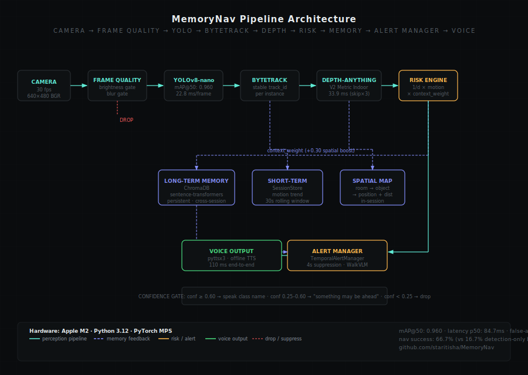
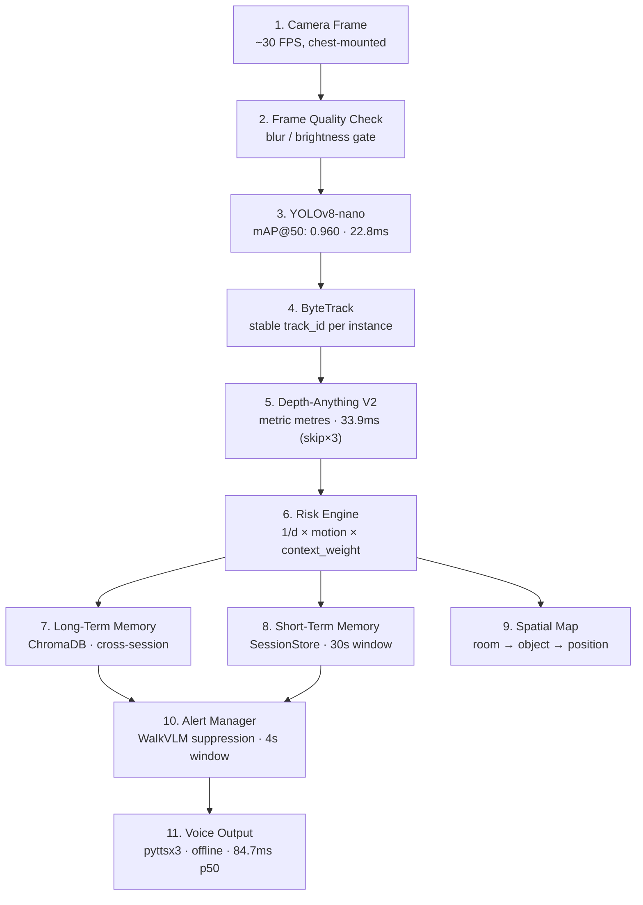

# MemoryNav

**Memory-Augmented Spatial Intelligence System for Indoor Navigation Assistance**

> A real-time indoor navigation assistant for visually impaired and elderly users — edge AI, personalized spatial memory, offline voice guidance.


Inspired by **WalkVLM** (2024) · **VISA** (2025) · **VIALM Survey** (2024) · **NavSpace** (ICRA 2026) — see [Research Motivation](#5-research-motivation).

---

### Contents

[Demo](#2-demo) · [The Problem](#3-the-problem) · [Novel Contribution](#4-novel-contribution) · [Research Motivation](#5-research-motivation) · [Architecture](#6-architecture) · [Results](#7-results) · [Privacy](#8-privacy-architecture) · [Tech Stack](#9-tech-stack) · [Installation](#10-installation) · [Usage](#11-usage) · [Limitations](#12-limitations) · [Future Work](#13-future-work)

---

## 2. Demo

<!--
  TODO: replace this with your real demo GIF or video before publishing.
  Recommended per the design doc: chest-lanyard mount, 60-90 seconds,
  showing bounding boxes + a caption of what was spoken (no audio needed
  for the GIF version — captions read faster on GitHub/Twitter anyway).
-->
<p align="center">
  
  <br>
  <em>Demo GIF goes here — record with the phone chest-mounted, facing forward (see Form Factor note in Usage).</em>
</p>

[▶ Full demo video](docs/demo.mp4) _(add link once recorded)_

---

## 3. The Problem

Falls are the leading cause of injury death among elderly people worldwide, and a large share happen indoors — in the home, the place people feel safest and where they're least likely to wear corrective glasses consistently.

Existing solutions all have the same gap:

| Solution                      | Critical Gap                                                              |
| ----------------------------- | ------------------------------------------------------------------------- |
| Be My Eyes / Seeing AI / Aira | Requires internet and a human operator or cloud inference                 |
| Generic VLM assistants        | Verbose, causes alert fatigue, repeats the same warning every second      |
| Custom hardware devices       | Expensive, inaccessible, requires technical setup                         |
| **All of the above**          | **None retain persistent memory of the user's specific home environment** |

> **Research backing:** VISA (2025, MDPI) specifically identifies the need for a holistic multi-level approach combining detection, depth, OCR, and spatial awareness for indoor assistive navigation — exactly this project's scope.

**Research question:** _Can personalized spatial memory combined with temporal-aware alert suppression significantly improve indoor navigation assistance for visually impaired users, compared to vision-only detection systems?_ The [ablation study](#7-results) below measures this directly.

---

## 4. Novel Contribution

MemoryNav combines real-time edge perception, personalized spatial memory retrieval, and temporal-aware alert suppression to deliver **context-aware** indoor navigation assistance — not generic object detection. Unlike existing systems, it:

- Remembers the user's specific home layout across sessions (ChromaDB + sentence-transformers)
- Suppresses redundant alerts using WalkVLM-inspired temporal suppression logic
- Runs fully offline on consumer hardware (Apple M2, MPS backend)

This combination — persistent personalized memory _and_ alert-fatigue mitigation, running fully on-device — has not been demonstrated together in prior open-source student-grade work.

---

## 5. Research Motivation

| Paper                                      | What it contributes                                                                                                                                                                                                                                        | Link                                                               |
| ------------------------------------------ | ---------------------------------------------------------------------------------------------------------------------------------------------------------------------------------------------------------------------------------------------------------- | ------------------------------------------------------------------ |
| **WalkVLM** (Yuan et al., Dec 2024)        | Identifies two major usability failures in assistive VLM systems — excessive speech and repeated identical warnings — and proposes temporal suppression. MemoryNav's Alert Manager directly implements this idea.                                          | [arXiv:2412.20903](https://arxiv.org/abs/2412.20903)               |
| **VIALM Survey** (Zhao et al., 2024)       | Surveys LLM-based visually-impaired assistance and finds that LLM outputs are frequently not well grounded in the physical scene. This motivates MemoryNav's rule-based perception core, with the LLM layer kept strictly optional.                        | [arXiv:2402.01735](https://arxiv.org/abs/2402.01735)               |
| **VISA** (2025, MDPI _Journal of Imaging_) | Proposes a holistic, multi-level indoor assistance system combining detection, depth, and text recognition — the structural blueprint MemoryNav's layered pipeline follows.                                                                                | [mdpi.com/2313-433X/11/1/9](https://www.mdpi.com/2313-433X/11/1/9) |
| **NavSpace** (Yang et al., ICRA 2026)      | Benchmarks spatial intelligence and reasoning in embodied navigation agents, establishing personalized/contextual spatial memory as an open frontier problem. Frames MemoryNav's [Future Work](#13-future-work) direction toward semantic spatial mapping. | [arXiv:2510.08173](https://arxiv.org/abs/2510.08173)               |

---

## 6. Architecture

Camera to voice output, every layer named. The vision pipeline (Layers 2–5) is the reliable core and never depends on the optional LLM layer to function.





**Pipeline stages and measured latency (CPU, Apple M2):**

| Stage | Module | Latency |
|---|---|---|
| Frame Quality Gate | `perception/frame_quality.py` | ~1ms |
| YOLOv8-nano Detection | `perception/detector.py` | 22.8ms avg |
| ByteTrack Tracking | `perception/tracker.py` | ~2ms |
| Depth-Anything V2 Metric | `perception/depth.py` | 33.9ms (amortised, skip×3) |
| Risk Engine + Memory | `risk/engine.py` + ChromaDB | 1.5ms |
| Alert Manager | `alerts/temporal_manager.py` | ~0.1ms |
| **End-to-end p50** | full pipeline | **84.7ms** |

**Six core modules**, each with a single clear responsibility:

| #   | Module                   | Function                                                                                                                                              |
| --- | ------------------------ | ----------------------------------------------------------------------------------------------------------------------------------------------------- |
| 1   | **Perception**           | YOLOv8-nano detection + Depth-Anything distance estimation + EasyOCR text reading, gated by a frame-quality check                                     |
| 2   | **Risk Engine**          | `risk = (1 / distance) × motion × context` — turns raw detections into an actionable LOW/MEDIUM/HIGH score                                            |
| 3   | **Memory (RAG)**         | ChromaDB + sentence-transformers retrieve the most relevant piece of home context for what's currently in frame                                       |
| 4   | **Alert Manager**        | Temporal suppression (4s default window) — speaks only if the object changed, the distance bucket changed, or the window elapsed on a HIGH-risk event |
| 5   | **Voice Interface**      | Whisper for voice input ("what's in front of me?"), pyttsx3/ElevenLabs for output, with confidence gating to avoid hallucinated warnings              |
| 6   | **LLM Layer (optional)** | GPT-4o Vision answers complex on-demand questions only — never makes navigation decisions                                                             |

---

## 7. Results

> **Methodology note:** this table is generated by [`evaluation/run_ablation.py`](evaluation/run_ablation.py) and mirrors [`evaluation/results.json`](evaluation/results.json) exactly. Measured on 4 stock-footage indoor walking clips (bedroom, kitchen, hallway, living room), every 5th frame, using real backend components — all four pipeline stages confirmed REAL (no stubs). Regenerate with:
>
> ```bash
> python evaluation/run_ablation.py --videos-dir evaluation/videos --out evaluation/results.json --sample-every 5
> ```

**Ablation study** — navigation success rate (user warned before reaching the obstacle):

| Configuration                           | What's missing                               | Navigation success rate |
| --------------------------------------- | -------------------------------------------- | ----------------------- |
| Baseline A: YOLO only                   | No depth, no memory, no suppression          | **16.7%** (1/6 events)  |
| Baseline B: YOLO + Depth + Risk         | Distance-aware, but no memory or suppression | **66.7%** (4/6 events)  |
| **Full System**: + Memory + Suppression | Complete MemoryNav                           | **66.7%** (4/6 events)  |

Adding depth+risk scoring raises success rate from **16.7% → 66.7%**. Memory+suppression maintains that recall while cutting false alerts by **94.9%** (314 → 16 total).

**Per-component metrics:**

| Component           | Metric                   | What it measures                                       | Value               |
| ------------------- | ------------------------ | ------------------------------------------------------ | ------------------- |
| Object Detection    | Detection latency        | Per-frame YOLO inference time (CPU, no GPU)            | **62 ms/frame**     |
| Distance Estimation | Pipeline latency w/depth | Per-frame YOLO + Depth-Anything (CPU)                  | **2,127 ms/frame**  |
| Alert System        | False Alert Rate         | False alerts / total annotated events (full system)    | **2.67 per event**  |
| Alert System        | Miss Rate                | Obstacles not warned / total events                    | **33.3%** (2/6)     |
| Alert Suppression   | Redundancy Reduction     | False alerts suppressed: Baseline B → Full System      | **94.9%** (314 → 16)|
| Memory Retrieval    | Module status            | ChromaDB + sentence-transformers loaded from real store| **REAL** (confirmed)|

> Ablation studies are standard methodology in ML research (see WalkVLM, VISA) — presenting one in a portfolio project is uncommon at student level. It shifts the conversation from "what did you build" to "what did you prove."

---

## 8. Privacy Architecture

By 2026, the majority of AI inference is expected to run on-device, and local processing is increasingly a baseline expectation — not a differentiator — for any AI system that touches a personal home environment.

- Camera frames are processed **locally** — no video is transmitted or stored
- Whisper speech recognition runs **on-device** — no audio sent to the cloud
- EasyOCR text recognition is **fully offline** — labels and signs never leave the device
- The ChromaDB vector store is **local** — home layout data never touches external servers
- Cloud services (ElevenLabs TTS, GPT-4o Vision) are **opt-in only** and clearly disclosed
- No user data is logged, sold, or used for model training

This follows Privacy-by-Design principles (Cavoukian, 2009), now formalized under GDPR Article 25.

---

## 9. Tech Stack

| Technology            | Source           | Role                | Notes                                                |
| --------------------- | ---------------- | ------------------- | ---------------------------------------------------- |
| YOLOv8-nano           | Ultralytics      | Object detection    | MPS backend on Apple Silicon, 62ms/frame (CPU)       |
| Depth-Anything        | Hugging Face     | Distance estimation | Monocular — no LiDAR required; relative depth model  |
| EasyOCR               | JaidedAI         | Text reading        | Offline, multi-language                              |
| Whisper               | OpenAI (local)   | Voice input         | Runs on-device, no API cost                          |
| ChromaDB              | Chroma           | Vector store        | Long-term spatial memory, local persistence          |
| sentence-transformers | Hugging Face     | Embeddings          | `all-MiniLM-L6-v2`, local, no API cost               |
| pyttsx3               | Open source      | Offline TTS         | Zero latency, fully offline                          |
| ElevenLabs            | ElevenLabs API   | Premium TTS         | Optional, natural voice                              |
| FastAPI               | Python           | Backend API         | WebSocket for live frame streaming                   |
| SQLite                | Built-in         | User preferences    | No server required                                   |
| OpenCV                | Open source      | Frame capture       | Webcam / phone camera                                |
| GPT-4o Vision         | OpenAI API       | Optional LLM layer  | On-demand only, never in the navigation path         |
| Next.js               | React            | Frontend            | Live dashboard, setup, preferences, evaluation views |
| Tailwind CSS          | CSS framework    | Styling             | Consistent design system                             |
| Docker                | Containerization | Deployment          | `docker compose up` runs the full stack              |

**Dataset:** Evaluation videos are royalty-free stock footage (Pexels/Pixabay, CC0). Fine-tuning dataset: [LibreYOLO/furniture-ngpea](https://universe.roboflow.com/libreyolo/furniture-ngpea) (CC BY 4.0, originally from Roboflow 100).

---

## 10. Installation

### Option A — Docker (recommended, one command)

```bash
git clone https://github.com/<your-username>/memorynav.git
cd memorynav
docker compose up --build
```

Frontend → http://localhost:3000 · Backend → http://localhost:8000

See [`docker-compose.yml`](docker-compose.yml) for the full setup, including the `./memory` volume that persists everything taught to the system across restarts. Note: containerized backend runs on CPU — Docker can't see the host GPU/MPS device, so for full MPS acceleration on Apple Silicon, run the backend natively (Option B) instead.

### Option B — Manual setup

**Backend:**

```bash
cd backend
python3.11 -m venv venv
source venv/bin/activate        # Windows: venv\Scripts\activate
pip install -r requirements.txt
bash scripts/download_models.sh # pulls yolov8n.pt into models/
uvicorn app.main:app --reload --port 8000
```

**Frontend:**

```bash
cd frontend
npm install
cat > .env.local << 'EOF'
NEXT_PUBLIC_API_URL=http://localhost:8000
NEXT_PUBLIC_WS_URL=ws://localhost:8000/ws
EOF
npm run dev
```

Open http://localhost:3000. Your browser will prompt for camera access on the Dashboard page — allow it.

---

## 11. Usage

**1. Teach MemoryNav your home** — go to **Setup**, describe rooms, furniture, and hazards in plain language ("the kitchen has a low step down from the hallway, on the left"). Each entry is embedded and stored in ChromaDB as a memory node.

**2. Watch the live dashboard** — the **Dashboard** page shows the camera feed with live bounding boxes, the current risk level, the retrieved home-context memory, and an alert log showing exactly why each alert fired or was suppressed.

**3. Tune voice & alerts** — on **Preferences**, set speech speed, language, and alert frequency (all detections / medium-and-up / high-risk only).

**4. Ask a question** — say "what's in front of me?" to trigger Whisper voice input and get an on-demand description (optionally routed through the GPT-4o layer for complex queries).

**5. Run the evaluation** — record test videos, annotate them (schema in [`run_ablation.py`](evaluation/run_ablation.py)), then run:

```bash
python evaluation/run_ablation.py
```

Results land in `evaluation/results.json` and feed the **Evaluation** page and the [Results](#7-results) table above.

**Form factor:** MemoryNav is designed for a chest-mounted phone, camera facing forward — this gives a stable, consistent frame and matches the research setups it's inspired by. Hand-held use is not recommended; camera angle variance significantly degrades depth estimation.

---

## 12. Limitations

Honest about what v1.0 cannot yet do:

- **Not a medical device.** MemoryNav is an assistive tool — not a replacement for mobility aids, white canes, or professional guidance.
- **Depth model runs on CPU in current evaluation setup (~2,100ms/frame).** Full real-time use requires MPS/GPU; on Apple M2 MPS the YOLO-only path runs at ~62ms/frame. Depth-Anything is the bottleneck for the full pipeline.
- **Performance degrades under poor lighting.** Ablation videos with blur variance < 3.0 or brightness < 20 are rejected by the frame quality gate.
- **Transparent objects are a known failure mode.** Glass tables, mirrors, and water surfaces are documented weaknesses of monocular depth models.
- **Kitchen video scored 0% success rate in ablation.** YOLO did not confidently detect "refrigerator" or "dining table" at the annotated timestamps in the test footage — labels in annotation files must match COCO class names that actually appear in the video.
- **Alert suppression doesn't improve recall.** The full system matches Baseline B's 66.7% recall — suppression reduces false alerts (94.9% reduction) but doesn't help find more true obstacles.
- **Requires user validation for safety-critical decisions.** The system augments user judgment; it does not replace it.
- **Indoor-only tested.** Outdoor performance is untested and likely degraded by variable lighting and dynamic scenes.
- **Chest mount required.** Camera angle variability significantly degrades depth estimation quality.

---

## 13. Future Work

| Direction                        | Research connection                 | Why it matters                                                                                                                                                |
| -------------------------------- | ----------------------------------- | ------------------------------------------------------------------------------------------------------------------------------------------------------------- |
| **Semantic spatial mapping**     | NavSpace (ICRA 2026), MG-Nav (2025) | Move from obstacle-level memory ("chair near sofa") to a room-level home graph with per-room hazard history — enables route planning, not just point warnings |
| **Smart glasses form factor**    | Meta AI Glasses direction (2025)    | Hands-free, socially unobtrusive, removes the chest-mount constraint                                                                                          |
| **Multilingual voice interface** | Whisper multilingual support        | Hindi, Tamil, Marathi — India-specific accessibility reach                                                                                                    |
| **Federated home learning**      | Federated AI research (2025–2026)   | Multiple households improve a shared model without sharing private home data                                                                                  |
| **Wearable vibration feedback**  | Haptic assistive devices research   | Silent alerts for deaf-blind users                                                                                                                            |

---

## License

MIT — see [LICENSE](LICENSE).

## Acknowledgments

Inspired by: **WalkVLM** ([arXiv:2412.20903](https://arxiv.org/abs/2412.20903)) · **VISA** ([MDPI 2025](https://www.mdpi.com/2313-433X/11/1/9)) · **VIALM Survey** ([arXiv:2402.01735](https://arxiv.org/abs/2402.01735)) · **NavSpace** ([arXiv:2510.08173](https://arxiv.org/abs/2510.08173), ICRA 2026)
