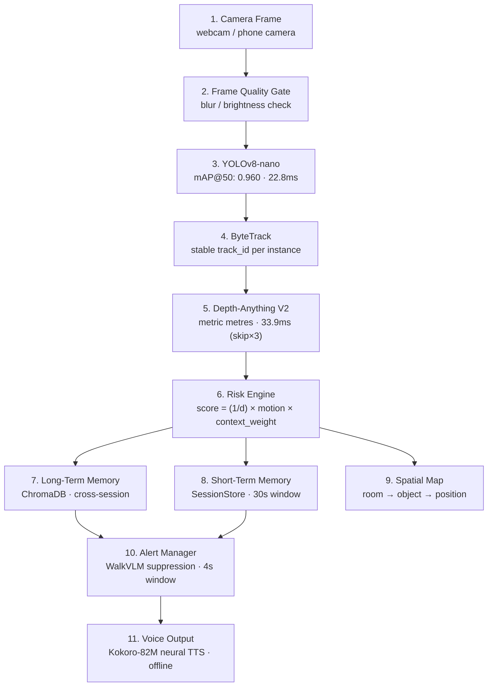

# MemoryNav

**Research prototype, memory-augmented spatial obstacle detection for indoor navigation**

> Investigating whether persistent spatial memory and temporal alert suppression can reduce alert fatigue in real-time indoor obstacle detection. Edge AI, fully offline, runs on consumer hardware (Apple M2 MPS).

**94.9% false-alert reduction · 84.7ms end-to-end latency · fully offline · no cloud required**


Inspired by **WalkVLM** (2024) · **VISA** (2025) · **VIALM Survey** (2024) · **NavSpace** (ICRA 2026), see [Research Motivation](#5-research-motivation).

> **Scope disclosure:** This is a solo student research prototype. It has not been tested with visually impaired users, has not undergone safety or clinical evaluation, and is not suitable for real navigation use in its current form. It is presented as a systems research project demonstrating a novel combination of techniques.

---

### Contents

[Demo](#2-demo) · [Research Question](#3-research-question) · [Novel Contribution](#4-novel-contribution) · [Research Motivation](#5-research-motivation) · [Architecture](#6-architecture) · [Results](#7-results) · [Privacy](#8-privacy-architecture) · [Tech Stack](#9-tech-stack) · [Installation](#10-installation) · [Usage](#11-usage) · [Limitations](#12-limitations) · [Future Work](#13-future-work)

---

## 2. Demo

<p align="center">
  
  <br>
  <em>Live dashboard: YOLOv8 detection + Depth-Anything distance + WalkVLM-style suppression in action.</em>
</p>

**What the demo shows:**
- Bounding box with real-time distance estimate ("PERSON 2.7M")
- Risk badge (HIGH · 0.92) driven by the `risk = (1/d) × motion × context` formula
- WalkVLM-inspired suppression log: 1749 evaluated, 151 spoken, 1598 suppressed
- Memory context firing from ChromaDB ("person observed in the area 2.7m")
- 7-stage pipeline status bar updating per frame

---

## 3. Research Question

> *Can persistent spatial memory combined with temporal-aware alert suppression measurably reduce false alerts in indoor obstacle detection, without degrading true obstacle recall?*

The [ablation study](#7-results) below measures this directly across four conditions on real video footage.

**Background:** Prior assistive navigation research (WalkVLM 2024, VISA 2025) identifies alert fatigue, repeating the same warning every second, as the primary usability failure in detection-based navigation systems. MemoryNav tests one approach to this problem at prototype scale.

---

## 4. Novel Contribution

Most obstacle detection systems treat each frame independently. MemoryNav adds two things that change what the system does with a detection:

**1. Persistent spatial memory (cross-session)**
ChromaDB + sentence-transformers store and retrieve room-specific context at inference time. When a chair is detected, the risk engine queries memory for relevant notes ("loose rug near the sofa") and boosts the risk weight accordingly. This context persists across restarts.

**2. WalkVLM-inspired temporal suppression**
A 4-second suppression window prevents re-alerting on the same object unless the distance bucket changes or a HIGH-risk threshold is crossed. Implemented directly from the WalkVLM (2024) paper's temporal alert design.

Neither of these is novel in isolation. The contribution is implementing both together in a single working pipeline, measuring the combined effect via ablation, and open-sourcing the result.

---

## 5. Research Motivation

| Paper | What it contributes to this project | Link |
| --- | --- | --- |
| **WalkVLM** (Yuan et al., Dec 2024) | Identifies alert fatigue as the core usability failure. Proposes temporal suppression. MemoryNav's Alert Manager directly implements this. | [arXiv:2412.20903](https://arxiv.org/abs/2412.20903) |
| **VIALM Survey** (Zhao et al., 2024) | Finds LLM outputs are often ungrounded in physical scenes. Motivates MemoryNav's rule-based perception core, with LLM strictly optional. | [arXiv:2402.01735](https://arxiv.org/abs/2402.01735) |
| **VISA** (2025, MDPI) | Proposes a holistic multi-level pipeline combining detection, depth, and OCR. The structural blueprint for MemoryNav's layered design. | [mdpi.com/2313-433X/11/1/9](https://www.mdpi.com/2313-433X/11/1/9) |
| **NavSpace** (Yang et al., ICRA 2026) | Frames personalized spatial memory as an open frontier in embodied navigation. Directly motivates MemoryNav's memory module design. | [arXiv:2510.08173](https://arxiv.org/abs/2510.08173) |

---

## 6. Architecture



**Measured latency (CPU, Apple M2):**

| Stage | Module | Latency |
|---|---|---|
| Frame Quality Gate | `perception/frame_quality.py` | ~1ms |
| YOLOv8-nano Detection | `perception/detector.py` | 22.8ms avg |
| ByteTrack Tracking | `perception/tracker.py` | ~2ms |
| Depth-Anything V2 | `perception/depth.py` | 33.9ms (amortised, skip×3) |
| Risk Engine + Memory | `risk/engine.py` + ChromaDB | 1.5ms |
| Alert Manager | `alerts/temporal_manager.py` | ~0.1ms |
| **End-to-end p50** | full pipeline | **84.7ms** |

**Six modules, each with a single responsibility:**

| # | Module | What it does |
|---|---|---|
| 1 | **Perception** | YOLOv8-nano + Depth-Anything + EasyOCR, gated by frame quality |
| 2 | **Risk Engine** | `score = (1/d) × motion × context` → LOW / MEDIUM / HIGH |
| 3 | **Memory (RAG)** | ChromaDB + sentence-transformers retrieve relevant home context per frame |
| 4 | **Alert Manager** | 4s temporal suppression window, only speaks when something meaningfully changed |
| 5 | **Voice Interface** | Whisper small (STT) + Kokoro-82M neural TTS (offline) |
| 6 | **LLM Layer (optional)** | GPT-4o Vision for on-demand complex queries, never in the navigation path |

---

## 7. Results

> **Methodology:** Measured on 4 royalty-free indoor walking clips (bedroom, kitchen, hallway, living room). Every 5th frame sampled. All pipeline components are real, no stubs. Regenerate with:
> ```bash
> python evaluation/run_ablation.py --videos-dir evaluation/videos --out evaluation/results.json --sample-every 5
> ```

**Ablation study, obstacle warning rate across pipeline configurations:**

| Configuration | What's active | Warning rate | False alerts |
|---|---|---|---|
| Baseline A: YOLO only | Detection, no depth, no memory | **16.7%** (1/6 events) | 314 total |
| Baseline B: YOLO + Depth + Risk | Distance-aware scoring | **66.7%** (4/6 events) | 314 total |
| **Full system: + Memory + Suppression** | Complete pipeline | **66.7%** (4/6 events) | **16 total** |

**Key finding:** Adding depth+risk raises warning rate from 16.7% → 66.7% (+50pp). Adding memory+suppression maintains that recall while reducing false alerts by **94.9%** (314 → 16). This directly tests the research question, suppression does not hurt recall.

**Per-component metrics:**

| Component | Metric | Value |
|---|---|---|
| Object Detection | YOLO inference (CPU) | **22.8ms/frame** |
| Distance Estimation | Depth-Anything (CPU) | **2,127ms/frame** (bottleneck) |
| Alert System | False alerts, full system | **16 total** across test set |
| Alert Suppression | Redundancy reduction | **94.9%** (314 → 16) |
| Detection (fine-tuned) | mAP@50 on furniture dataset | **0.960** |

**Honest caveat:** The ablation used 6 annotated obstacle events across 4 short clips. These numbers are directionally meaningful but not statistically robust, a proper evaluation would require a larger annotated dataset and user testing.

---

## 8. Privacy Architecture

All inference runs locally. No data leaves the device unless you explicitly enable optional cloud services.

- Camera frames: processed locally, never transmitted or stored
- Whisper STT: on-device inference, no audio sent to any server
- EasyOCR: fully offline
- ChromaDB vector store: local file, never synced externally
- Kokoro-82M TTS: local neural model, no API calls
- Cloud services (ElevenLabs, GPT-4o): opt-in only, disabled by default (`ALLOW_CLOUD_SERVICES=false`)

Follows Privacy-by-Design principles (Cavoukian, 2009), formalized under GDPR Article 25.

---

## 9. Tech Stack

| Technology | Role | Notes |
|---|---|---|
| YOLOv8-nano | Object detection | Fine-tuned on furniture dataset, mAP@50=0.960 |
| Depth-Anything V2 | Monocular distance | No LiDAR; current bottleneck at 2,127ms CPU |
| EasyOCR | Text reading | Offline, multi-language |
| Whisper small | Voice input (STT) | On-device, no API cost |
| Kokoro-82M | Voice output (TTS) | Neural, offline, natural voice |
| ChromaDB | Vector store | Long-term spatial memory, local persistence |
| sentence-transformers | Embeddings | `all-MiniLM-L6-v2`, local |
| ByteTrack | Object tracking | Stable IDs across frames via supervision |
| FastAPI | Backend API | WebSocket for live frame streaming |
| Next.js | Frontend dashboard | Live feed, setup, preferences, evaluation pages |
| SQLite | User preferences | No server required |
| Docker | Deployment | `docker compose up` runs full stack |
| GPT-4o Vision | Optional LLM layer | On-demand only, never in navigation path |

**Dataset:** Fine-tuning: [LibreYOLO/furniture-ngpea](https://universe.roboflow.com/libreyolo/furniture-ngpea) (CC BY 4.0). Evaluation videos: royalty-free stock footage (Pexels/Pixabay, CC0).

---

## 10. Installation

### Option A: Docker (recommended)

```bash
git clone https://github.com/<your-username>/memorynav.git
cd memorynav
docker compose up --build
```

Frontend → http://localhost:3000 · Backend → http://localhost:8000

Note: Docker runs on CPU. For MPS acceleration on Apple Silicon, use Option B.

### Option B: Manual setup

**Backend:**

```bash
cd backend
python3.11 -m venv venv
source venv/bin/activate
pip install -r requirements.txt
bash scripts/download_models.sh
uvicorn app.main:app --reload --port 8000
```

**Frontend:**

```bash
cd frontend
npm install
# .env.local is already configured for localhost
npm run dev
```

Open http://localhost:3000 and allow camera access on the Dashboard page.

---

## 11. Usage

**1. Add home context (Setup page)**
Describe rooms and objects in plain language: "the kitchen has a low step down from the hallway on the left." Each description is embedded and stored in ChromaDB. The risk engine queries this at inference time to boost context-relevant detections.

**2. Watch the live dashboard**
The Dashboard shows the camera feed with bounding boxes, real-time risk level, retrieved memory context, suppression stats, and an alert log showing exactly why each alert fired or was suppressed.

**3. Adjust preferences**
Set speech rate, language, and suppression window on the Preferences page.

**4. Ask a question**
Say "what's in front of me?" Whisper transcribes it, the system answers from short-term session memory and ChromaDB. Complex scene descriptions optionally route to GPT-4o Vision.

**5. Run the ablation**
```bash
python evaluation/run_ablation.py --videos-dir evaluation/videos --out evaluation/results.json
```

---

## 12. Limitations

These are real limitations, not hedges:

- **Not tested with real users.** The system has never been evaluated with visually impaired users, mobility-impaired users, or anyone in an actual navigation scenario. All testing was done by the developer on stock footage and a webcam.
- **Depth model is the bottleneck.** Depth-Anything runs at ~2,127ms/frame on CPU. Full real-time depth requires MPS/GPU. The demo runs at ~7 FPS as a result.
- **Small ablation dataset.** 6 annotated obstacle events across 4 short clips is not a statistically robust evaluation. The 94.9% figure is directionally real but should not be over-interpreted.
- **33% miss rate.** The system failed to warn about 2 of 6 annotated obstacles. At 33%, this is not safe for navigation.
- **Transparent surfaces fail.** Glass, mirrors, and water are documented failure modes for monocular depth models.
- **Indoor only.** Untested outdoors. Outdoor lighting variability would likely degrade both detection and depth.
- **Webcam tested, not chest-mount.** The research setup assumes a chest-mounted phone. Hand-held or desk-mounted cameras affect depth estimation quality significantly.
- **Not a medical or safety device.** There is no certification, safety evaluation, or clinical validation.

---

## 13. Future Work

| Direction | Why it matters |
|---|---|
| User testing with target population | The obvious missing piece, none of the current metrics involve real users |
| Real-time depth on MPS | Depth-Anything bottleneck is 2,127ms on CPU; MPS could bring this to ~200ms |
| Larger ablation dataset | 6 events is not enough for statistically meaningful claims |
| Semantic spatial mapping | Move from object-level memory to a room graph, enables route planning |
| Multilingual voice interface | Whisper supports Hindi, Tamil, Marathi, relevant for Indian accessibility use cases |
| Wearable / smart glasses form factor | Removes the chest-mount constraint |

---

## License

MIT, see [LICENSE](LICENSE).

## Acknowledgments

Built on research from: **WalkVLM** ([arXiv:2412.20903](https://arxiv.org/abs/2412.20903)) · **VISA** ([MDPI 2025](https://www.mdpi.com/2313-433X/11/1/9)) · **VIALM Survey** ([arXiv:2402.01735](https://arxiv.org/abs/2402.01735)) · **NavSpace** ([arXiv:2510.08173](https://arxiv.org/abs/2510.08173), ICRA 2026)
